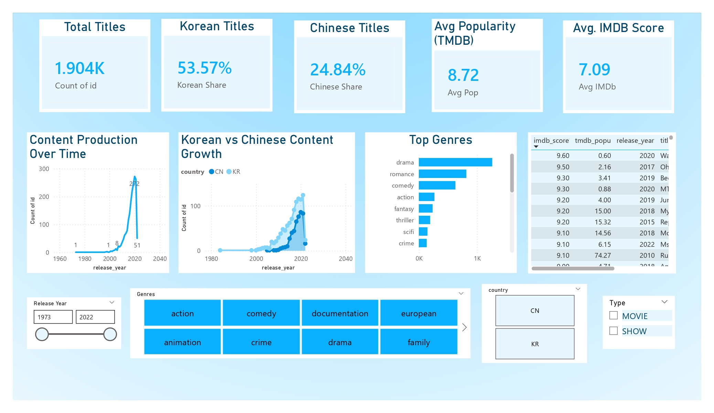

#  Rakuten Viki TV Dramas & Movies — Analytics & Content Strategy Dashboard

   <div align="center">


</div>


<p align="center">
  
</p>

<p align="center">
  <b>Data-Driven Insights for Asian Drama Content Strategy</b><br>
  <i>Built with PostgreSQL, Python, and Power BI</i>
</p>

---

## 📋 Table of Contents

- [🌟 Project Overview](#-project-overview)
- [💡 Business Problem](#-business-problem)
- [🎯 Project Objectives](#-project-objectives)
- [🛠️ Tech Stack](#-tech-stack)
- [🚀 Approach](#-approach)
- [📊 Dashboard](#-dashboard)
- [❓ Key Business Questions & SQL Answers](#-key-business-questions--sql-answers)
- [📈 Results & Impact](#-results--impact)

---

## 🌟 Project Overview

Rakuten Viki is a global streaming platform for Asian dramas and movies.  
This project analyzes the **Rakuten Viki TV Dramas & Movies** catalog to uncover:

- Content growth patterns over time  
- Which countries dominate production  
- Which genres, certifications, runtimes, actors, and directors define success  
- Ratings and popularity trends (IMDb & TMDB)  
- Strategic recommendations for content licensing and expansion  

This is a **full end-to-end analytics project** using **PostgreSQL, Python, and Power BI**.

---

## 💡 Business Problem

> **How should Rakuten Viki prioritize licensing and original content investments across countries, genres, and formats to maximize growth, given limited budget and rapidly shifting audience preferences?**

Viki needs to understand:

- Which regions dominate (Korea, China, Japan, Taiwan, etc.)  
- Which content types & genres are oversaturated vs. under-supplied  
- What drives high IMDb ratings and TMDB popularity  
- Which actors/directors repeatedly appear in successful titles  

This analysis delivers insights that directly support **content acquisition, marketing, and audience growth strategies**.

---

## 🎯 Project Objectives

- Build a clean, trusted analytical dataset from Viki metadata  
- Analyze production trends by **year, country, genre, certification, and runtime**  
- Identify **high-performing titles, actors, and directors**  
- Detect **content gaps** where demand likely exceeds supply  
- Build a **Viki-themed Power BI dashboard** for interactive exploration  

---

## 🛠️ Tech Stack

| Tool            | Purpose                               |
|-----------------|----------------------------------------|
| **PostgreSQL**  | Data storage & SQL analytics           |
| **Python**      | EDA & data transformations             |
| **Power BI**    | Interactive dashboard & visuals        |
| **DAX**         | Custom measures for KPIs & shares      |
| **GitHub**      | Version control & project hosting      |

---

## 🚀 Approach


1️⃣ **Data Preparation**  
- Loaded `titles` and `credits` CSV files into PostgreSQL  
- Cleaned list-like fields (`genres`, `production`) into normalized rows  
- Standardized country codes, trimmed whitespace  
- Created helper views/tables: `titles_rated`, exploded genre/country queries  

2️⃣ **SQL Analysis Layer**  
- Wrote modular SQL queries with CTEs & DISTINCT counts  
- Generated all KPIs: total titles, shares, trends, ratings, popularity  
- Built country, genre, runtime, and people-based aggregations  

3️⃣ **Power BI Dashboard**  
- Connected to PostgreSQL (Import mode)  
- Designed a **Viki-blue gradient** dashboard  
- Added KPI cards, trend lines, bar charts, and drill-down tables  
- Included slicers for **Country, Genre, Type, Release Year**  

## 📊 Dashboard

For example:

<p align="center">
  
</p>

---

### 🟦 1. Is Korean content dominating the catalog?

#### SQL Query

```sql
WITH country_exploded AS (
  SELECT
    id,
    trim(upper(regexp_replace(
      unnest(string_to_array(
        regexp_replace(production, '[\[\]]', '', 'g'),
        ','
      )),
      '''', '', 'g'
    ))) AS country_code
  FROM viki.titles
)
SELECT
  country_code,
  COUNT(DISTINCT id) AS title_count,
  ROUND(
    100.0 * COUNT(DISTINCT id) / NULLIF((SELECT COUNT(*) FROM viki.titles), 0),
    2
  ) AS pct_of_catalog
FROM country_exploded
GROUP BY country_code
ORDER BY title_count DESC;
```
# Results:


# Analysis:
Korean content accounts for over half of Viki’s entire catalog, making it the platform’s strongest content pillar. This reflects not only the global momentum behind Korean dramas but also Viki’s strategic emphasis on licensing Korean titles to meet rising demand.
In contrast, Chinese content, while still substantial, forms a smaller but significant portion of the library, indicating a growing yet secondary source of viewership.
Together, these trends highlight Viki’s reliance on East Asian markets and pinpoint where future licensing decisions can be optimized.

### 🟦 2. How has overall content production evolved over time?

#### SQL Query

```sql
SELECT
  release_year,
  COUNT(*) AS titles
FROM viki.titles
WHERE release_year IS NOT NULL
GROUP BY release_year
ORDER BY release_year;
```
# Results:


# Analysis:
The trend in content production on Rakuten Viki shows a remarkably clear story of growth, acceleration, and strategic expansion. For nearly three decades, production volumes remained minimal, with only a handful of titles released each year. This slow start is expected—Asian drama exports were limited, and global demand for Korean, Chinese, and other regional content had not yet surfaced.

However, the landscape begins to shift around the late 2000s. A modest increase is seen between 2008 and 2012, followed by a sharp and sustained growth phase starting from 2013. This period aligns closely with the global rise of Hallyu (the Korean Wave), the increased popularity of Asian dramas, and streaming platforms making international licensing more accessible.

The most dramatic surge occurs between 2016 and 2020, where yearly releases jump steeply—from double-digit counts to nearly 300 titles in 2020, the dataset’s peak. This represents an unprecedented expansion of Viki’s catalog, reflecting both skyrocketing demand and aggressive content acquisition strategies.

The decline after 2020, with 51 titles in 2021, is expected since the dataset ends around that range and may not include complete records for the following years.

Overall, this trend highlights how Rakuten Viki transitioned from a niche Asian drama provider to a major global streaming platform, scaling its library rapidly to match audience interest. The production curve reflects not just quantity, but the strategic timing of market opportunity—an inflection point that enabled Viki to strengthen its competitive position in the global streaming ecosystem.

### 🟦 3. How do Korean vs Chinese growth trends compare?

#### SQL Query

```sql
WITH country_exploded AS (
  SELECT
    id,
    release_year,
    trim(upper(regexp_replace(
      unnest(string_to_array(
        regexp_replace(production, '[\[\]]', '', 'g'),
        ','
      )),
      '''', '', 'g'
    ))) AS country_code
  FROM viki.titles
  WHERE release_year IS NOT NULL
),
year_totals AS (
  SELECT
    release_year,
    COUNT(DISTINCT id) AS total_titles
  FROM viki.titles
  WHERE release_year IS NOT NULL
  GROUP BY release_year
)
SELECT 
  yt.release_year,
  COUNT(DISTINCT CASE WHEN country_code = 'KR' THEN id END) AS korea_titles,
  COUNT(DISTINCT CASE WHEN country_code = 'CN' THEN id END) AS china_titles,
  yt.total_titles,
  ROUND(
    100.0 * COUNT(DISTINCT CASE WHEN country_code = 'KR' THEN id END)
      / yt.total_titles,
    2
  ) AS korea_share_pct
FROM year_totals yt
LEFT JOIN country_exploded ce
  ON ce.release_year = yt.release_year
GROUP BY yt.release_year, yt.total_titles
ORDER BY yt.release_year;
```

### 🟦4. Which countries besides Korea & China matter?
#### SQL Query

```sql
WITH country_exploded AS (
  SELECT
    trim(upper(regexp_replace(
      unnest(string_to_array(
        regexp_replace(production, '[\[\]]', '', 'g'),
        ','
      )),
      '''', '', 'g'
    ))) AS country_code
  FROM viki.titles
)
SELECT
  country_code,
  COUNT(*) AS title_count
FROM country_exploded
WHERE country_code NOT IN ('KR', 'CN')
GROUP BY country_code
ORDER BY title_count DESC
LIMIT 10;
```
# Results:


# Analysis:
While Korean and Chinese titles undeniably dominate Viki’s catalog, the platform’s content diversity is far broader than these two giants alone. When we isolate all other producing countries, a fascinating secondary ecosystem emerges one that plays a crucial role in shaping Viki’s global appeal.

The data reveals that Japan (JP) stands out as the most significant contributor after KR and CN, with 114 titles in the catalog. This is a substantial presence and reflects the strong international fanbase for J-dramas, which are known for their unique storytelling, compact episode structures, and emotionally resonant themes. Japanese content consistently attracts a loyal global audience, making it an essential pillar of Viki’s catalog.

Next, Taiwan (TW) contributes 75 titles, reinforcing the continued popularity of Taiwanese romance dramas often beloved for their lighthearted plots and nostalgic storytelling style. This positions Taiwan as a key player in the romance and youth-drama segments.

Hong Kong (HK) appears third with 38 titles, marking its influence in crime, action, and classic Cantonese drama genres. Although these shows target more niche audiences, they add cultural depth and genre variety to Viki’s offerings.

Surprisingly, the dataset also highlights meaningful contributions from non-Asian markets such as the United States (US) with 30 titles, and Canada (CA) and Great Britain (GB) with 5 each. Their presence suggests cross-regional collaborations or content categorized under Asian-led casts, diasporic narratives, or partnerships between production companies.

Other Asian contributors like Thailand (TH) and Vietnam (VN) add emerging representation. Thai content, in particular, has recently surged in global popularity due to the rise of BL dramas and youth-focused series , an area with rapidly growing international demand.

Overall, these results highlight that while Korea and China dominate production volume, the richness of Viki’s catalog is significantly enhanced by Japan, Taiwan, Hong Kong, Thailand, and select Western contributors. This multi-country mix helps Viki serve diverse audience preferences and mitigates over reliance on any single regional content pipeline,an important insight for content strategy and acquisition planning.

### 🟦5. Which genres dominate the platform?
#### SQL Query

```sql
WITH genre_exploded AS (
  SELECT
    trim(unnest(string_to_array(
      regexp_replace(
        regexp_replace(genres, '\[|\]', '', 'g'),
        '''',
        ''
      ),
      ','
    ))) AS genre
  FROM viki.titles
)
SELECT
  genre,
  COUNT(*) AS title_count
FROM genre_exploded
GROUP BY genre
ORDER BY title_count DESC
LIMIT 20;
```
# Results:


# Analysis :
The genre breakdown highlights one of Viki’s strongest competitive advantages , its ability to deliver emotionally resonant, story-driven content that appeals to global drama enthusiasts. The data shows that Drama is by far the most dominant genre, with over 800+ titles, reflecting Viki’s position as a leading destination for character-focused narratives and long-form storytelling typical in Asian entertainment industries.

Close behind, Romance emerges as the second strongest category, with nearly 700 titles. This isn’t surprising, as Viki is widely known for its romance-centric catalog, especially Korean and Taiwanese series that consistently draw massive international engagement. The continued popularity of romance dramas signals strong viewer demand for emotional, relationship-driven story arcs.

Genres like Comedy, Fantasy, Action, and Thriller make up the next tier, collectively adding depth and variety to the catalog. Comedy's presence appearing twice due to variations in tagging shows viewers’ appetite for lighthearted, humorous storytelling. Meanwhile, Fantasy and Thriller signal the growing appeal of supernatural plots, crime-solving narratives, and high-concept worlds that have surged in popularity due to Korean and Chinese productions.

Interestingly, genres such as History, Sci-Fi, Crime, and Reality are present but in much smaller quantities. These categories represent niche yet loyal audiences and provide opportunities for Viki to expand into underserved content areas. For instance, historical dramas often attract highly engaged fans due to their cultural richness, while Sci-Fi remains relatively under-represented, offering room for future growth.

Overall, the genre distribution reinforces that Viki’s catalog is built fundamentally on Drama and Romance, supported by popular secondary genres and sprinkled with niche categories that broaden the platform’s global appeal. These insights can guide smart content acquisition , doubling down on what works while identifying areas where expanding the library could meet emerging user demand.

### 🟦6. How is content positioned by age certification?
#### SQL Query

```sql
SELECT
  age_certification,
  COUNT(*) AS title_count
FROM viki.titles
GROUP BY age_certification
ORDER BY title_count DESC;
```
# Results:


# Analysis :
The age-certification distribution reveals an interesting pattern in Viki’s content strategy, reflecting both regional production norms and audience expectations for Asian dramas. A striking majority of titles over 1,630 entries—have no age rating listed. This is common among Asian streaming datasets, where age classifications are not consistently standardized across countries. While the absence of ratings limits granularity, it also highlights a clear opportunity for Viki to improve metadata completeness and support safer, more personalized recommendations.

Among the titles that do have certifications, TV-14 stands out as the most dominant category with 138 titles, aligning with Viki’s family-friendly brand. This rating typically includes mild romance, light conflict, and limited mature themes , perfectly matching the tone of Korean, Chinese, and Taiwanese dramas that form Viki’s core catalog. The strong representation of TV-14 content reinforces Viki’s appeal to a broad international audience, including teens and young adults.

TV-MA, TV-PG, and TV-Y follow as smaller but meaningful segments. TV-MA titles , just 33 entries represent more mature themes such as violence or heavy emotional content. Their smaller presence suggests that Viki’s content strategy leans intentionally toward emotionally rich but generally clean storytelling, rather than the gritty or explicit genres more common on Western platforms.

Meanwhile, TV-PG, TV-Y, and PG-13 categories indicate that the platform still supports younger viewers and family audiences with a spread of lighter, comedic, or inspirational content. Certifications like R, PG, and TV-G, while rare, add nuance and signal Viki’s ability to offer a modest variety of tones across its catalog.

Overall, Viki’s age-certification profile reflects a platform centered around safe, approachable, and universally appealing content, with a strong tilt toward romance and drama that avoids heavy mature themes. For business decision-makers, this distribution underscores the importance of continuing to acquire content that aligns with Viki’s core brand identity , while also considering selective expansion into mature genres to attract broader, adult demographics.

### 🟦7. What does runtime distribution reveal about format strategy?
#### SQL Query

```sql
SELECT 
  type,
  CASE 
    WHEN runtime < 30 THEN '<30 min'
    WHEN runtime BETWEEN 30 AND 59 THEN '30–59 min'
    WHEN runtime BETWEEN 60 AND 89 THEN '60–89 min'
    WHEN runtime >= 90 THEN '90+ min'
    ELSE 'Unknown'
  END AS runtime_bucket,
  COUNT(*) AS title_count
FROM viki.titles
GROUP BY type, runtime_bucket
ORDER BY type, runtime_bucket;

```
# Results:


# Analysis:
The runtime distribution paints a very clear picture of how Viki structures its catalog and it strongly reinforces the platform’s identity as a home for long-form storytelling, especially through Asian dramas.

For movies, the data reveals a heavy concentration in the 90+ minute category, with 383 titles falling into feature-length territory. This aligns perfectly with traditional film standards and indicates that Viki’s movie offerings are largely full-length cinematic experiences rather than short-form or experimental content. Meanwhile, shorter movie formats such as those under 60 minutes are extremely rare, further emphasizing Viki’s focus on polished, narrative-rich productions.

On the other hand, shows follow a distinctly different pattern that mirrors the structure of Korean dramas, Chinese dramas, and other Asian episodic formats. The majority of shows fall within the 30–59 minute (670 titles) and 60–89 minute (546 titles) buckets. This is exactly the typical runtime range for scripted episodes in Asia, where single-episode durations often exceed Western standards to allow for deeper emotional arcs and more detailed character development.

Interestingly, Viki hosts 218 short-form shows (<30 minutes) a sign that bite-sized drama and variety content is emerging but not yet dominant. These could reflect web dramas, short comedic sketches, or youth-focused mini-series that reinforce Viki’s appeal to younger audiences looking for quicker, more casual viewing experiences.

Conversely, only 36 shows exceed 90 minutes, highlighting that long-form episodic content is not as common. This low number underscores the structured, episode-based nature of Asian dramas, where length is distributed across episodes rather than single, extended installments.

Overall, the runtime distribution shows that Viki’s content strategy is built around rich, immersive, long-format storytelling, particularly in the episodic drama space. Movies are full-length and traditional, while shows follow the established pacing of Asian television , engaging, emotional, and designed to keep viewers invested across multiple episodes. This focus is a core part of Viki’s brand and continues to be a major differentiator in the global streaming landscape.

### 🟦8. Which titles perform best by IMDb and TMDB metrics?
#### SQL Query-– Top-Rated (IMDb)

```sql
SELECT
  title,
  release_year,
  production,
  imdb_score,
  imdb_votes
FROM viki.titles
WHERE imdb_score IS NOT NULL
ORDER BY imdb_score DESC NULLS LAST, imdb_votes DESC NULLS LAST
LIMIT 20;
```
# Results:


# Analysis :
The IMDb-ranked titles reflect shows and films that delivered exceptional emotional impact, storytelling depth, and audience satisfaction. These are the titles viewers felt strongly enough to rate 9.0+, placing them among the best Asian dramas available internationally.

The chart is led by WayVision (2020) with a remarkable 9.6, followed closely by Chinese hit Oh My General (2017) and Korean documentary-styled favorite Because I Want to Talk (2019).

Korean dramas dominate the high-rating segment, with titles like:

1. Reply 1988 (9.2) — universally loved, nostalgic, and culturally significant

2. My Mister (9.2) — critically acclaimed for its maturity and emotional realism

3. Mother (9.1) — a gripping thriller with powerful performances

4. Running Man (9.1) — one of Asia’s most iconic variety shows

These titles stand out not only for craftsmanship, but also for long-term fan devotion. Their consistently high ratings confirm that deeply emotional, character-driven Korean series form the backbone of Viki’s critically acclaimed content.

Chinese titles like Ms. Cupid in Love (9.1) and Oh My General (9.5) also appear strongly, showing that Chinese historical and romantic dramas continue to secure passionate, loyal viewership.

*In short*: IMDb highlights the most beloved and highest-quality productions on the platform.

#### SQL Query--Most Popular (TMDB)
```sql
SELECT
  title,
  release_year,
  production,
  tmdb_popu,
  tmdb_score
FROM viki.titles
WHERE tmdb_popu IS NOT NULL
ORDER BY tmdb_popu DESC NULLS LAST, tmdb_score DESC NULLS LAST
LIMIT 20;
```
# Results:


# Analysis :
TMDB’s popularity rankings tell a slightly different story here, visibility, trendiness, and social buzz take center stage.

The No.1 most popular title is The Oath of Love (2022) with a massive 381 popularity score, driven by its A-list cast (Xiao Zhan & Yang Zi), social media hype, and cross-regional appeal.
Other highly popular Chinese titles include:

1. Please Enlighten Me (2021)

2. Master Devil Do Not Kiss Me (2017)

These reflect the huge pull of modern Chinese romance series among younger global audiences.

Korean productions also show strong popularity momentum, with high-performing titles such as:

1. True Beauty (2020) — a global sensation among Gen-Z viewers

2. Train to Busan (2016) — a world-famous blockbuster

3. Goblin (2016) — one of the most iconic K-dramas of all time

4. You Hee-yeol’s Sketchbook (2009) — extremely long-running and culturally iconic

Popularity brings to light titles that may not be the highest rated critically, but excel due to mass appeal, fandom activity, genre trends, and viral cultural impact.

*In short*: TMDB highlights the most watched, most talked-about, and most globally visible titles.
### 🟦9. Do certain actors repeatedly appear in successful titles?
#### SQL Query


```sql
WITH top_titles AS (
  SELECT id
  FROM viki.titles
  WHERE imdb_score IS NOT NULL
  ORDER BY imdb_score DESC
  LIMIT 200
)
SELECT
  c.name,
  COUNT(*) AS appearances_in_top_titles
FROM viki.credits c
JOIN top_titles t
  ON c.id = t.id
WHERE c.role = 'ACTOR'
GROUP BY c.name
ORDER BY appearances_in_top_titles DESC
LIMIT 10;
```
# Results:


# Analysis :
The analysis of the highest-rated titles reveals a clear pattern: a small group of seasoned Korean actors consistently appear in the most successful productions on Viki. These actors aren’t just familiar faces  they are reliable contributors to audience satisfaction and narrative quality, often elevating the projects they join.

At the top of the list is Sung Dong-il, who appears in 8 of the top-rated titles. His presence across genres from heartfelt dramas to family series , highlights his broad appeal and the trust production studios place in his acting versatility. Close behind are Kang Ki-young and Ahn Nae-sang, each appearing in 7 top-performing titles. Their recurring presence in acclaimed dramas underscores how impactful strong supporting actors can be in shaping the emotional depth and relatability of a story.

Actors such as Kim Mi-kyeong, Kim Won-hae, and Ahn Suk-hwan also appear multiple times, each with 6 appearances in the highest-rated catalog. These are industry veterans known for their consistent ability to enhance storytelling , often becoming fan favorites despite not always taking on leading roles.

The prominence of these actors in top titles suggests that casting decisions play a significant role in audience reception. Viewers tend to gravitate toward familiar, reliable performers, especially in emotional or character-driven narratives where nuanced acting is essential. Their involvement may also signal production quality, making these actors valuable anchors for high-impact series.

Overall, this pattern highlights how a core group of talented professionals significantly influence the success of Korean dramas on Viki. For the platform, recognizing these recurring contributors can support smarter licensing, targeted promotions, and improved content recommendations, ultimately enhancing viewer satisfaction and engagement.

### 🟦10. Do certain directors repeatedly appear in successful titles?
#### SQL Query

```sql
WITH top_titles AS (
  SELECT id
  FROM viki.titles
  WHERE imdb_score IS NOT NULL
  ORDER BY imdb_score DESC
  LIMIT 200
)
SELECT
  c.name,
  COUNT(*) AS directed_top_titles
FROM viki.credits c
JOIN top_titles t
  ON c.id = t.id
WHERE c.role = 'DIRECTOR'
GROUP BY c.name
ORDER BY directed_top_titles DESC
LIMIT 20;
```
# Results:


# Analysis :
A closer look at the highest-rated titles reveals that several directors consistently contribute to Viki’s most successful content. These directors not only demonstrate a strong command of storytelling and production quality, but their repeated presence across top-performing titles suggests they play an influential role in shaping the platform’s most compelling narratives.

Leading the list are Jo Soo-won, Lee Jung-sub, and Lam Yuk Fan, each with 3 top-rated titles under their direction. Their projects often combine strong emotional arcs, refined pacing, and memorable character development , qualities that resonate strongly with Viki’s global audience. Their consistent success reflects an ability to craft stories that balance cultural authenticity with universal appeal.

Following closely are respected directors such as Park Chan-hong, Lee Eung-bok, Lee Tae-gon, Kim Won-seok, Kim Cheol-kyu, Kim Jin-woo, and Kim Jung-hyun, each contributing 2 highly-rated hits. Many of these creators are known for genre-defining K-dramas and have played pivotal roles in elevating the international reputation of Korean storytelling.

What stands out is the stability of these directors' impact: despite varying genres , from romance to crime thrillers to historical dramas , these filmmakers consistently deliver productions that captivate audiences and perform strongly on both rating and popularity metrics.

For Rakuten Viki, recognizing the directors who repeatedly produce high-quality, high-engagement content is valuable. Their involvement in future licensing or partnership decisions can serve as a strong indicator of potential audience success. Moreover, highlighting their work in promotional material or curated collections can further boost user engagement, reinforcing Viki’s positioning as a platform for premium Asian storytelling.

### 🟦11. Are there content gaps where demand exceeds supply?
#### SQL Query

```sql
WITH genre_exploded AS (
  SELECT
    t.id,
    trim(unnest(string_to_array(
      regexp_replace(
        regexp_replace(t.genres, '\[|\]', '', 'g'),
        '''',
        ''
      ),
      ','
    ))) AS genre,
    t.imdb_score
  FROM viki.titles t
)
SELECT
  genre,
  COUNT(DISTINCT id) AS title_count,
  ROUND(
    AVG(imdb_score) FILTER (WHERE imdb_score IS NOT NULL),
    2
  ) AS avg_imdb_score
FROM genre_exploded
GROUP BY genre
HAVING COUNT(DISTINCT id) >= 5
ORDER BY avg_imdb_score DESC;
```
# Results:


# Analysis :
The genre–rating analysis reveals some of the most strategic insights for Rakuten Viki’s content planning. By comparing average IMDb scores with the number of available titles in each genre, we can identify where audience appreciation is high but supply is relatively limited — a clear indicator of unmet demand.

What stands out immediately is that several high-performing genres are significantly underrepresented in the catalog. Genres like History, Reality, and Sci-Fi deliver some of the strongest average ratings (7.5+, 7.5+, and 7.3 respectively), despite having far fewer total titles compared to mainstream categories. Their strong viewer reception even with limited content signals clear opportunities for Viki to expand its library in these spaces.

For example:

History has an impressive 7.54 average rating but only 111 titles, suggesting that audiences value deep storytelling, period pieces, and culturally rich narratives that explore historical themes. Increasing titles here could significantly boost engagement.

Reality content earns a 7.53 average rating across just 92 titles, highlighting a niche but highly appreciative audience. Reality formats are known for strong rewatch value and community engagement  making this a high-potential growth area.

Sci-Fi, often limited in Asian markets, still achieves a strong 7.37 rating with 149 titles. This indicates that viewers are eager for more futuristic and high-concept storytelling, which is presently underserved.

In contrast, genres such as Drama, Romance, and Comedy dominate the catalog quantitatively, yet their ratings are only mid-range. This saturation suggests that adding more titles to these categories may not yield the same engagement lift as focusing on higher-rated but under-supplied genres.

Overall, this analysis highlights that Viki can strategically strengthen its catalog by investing in genres where viewer demand is high but content availability is low. Expanding high-rated but underrepresented genres can diversify viewing options, enhance platform stickiness, and better serve niche communities that are already demonstrating strong enthusiasm.

### 🟦12. How do ratings vary by country and genre?
#### SQL Query– Ratings by Country

```sql
WITH country_exploded AS (
  SELECT
    id,
    trim(upper(regexp_replace(
      unnest(string_to_array(
        regexp_replace(production, '[\[\]]', '', 'g'),
        ','
      )),
      '''', '', 'g'
    ))) AS country_code,
    imdb_score
  FROM viki.titles
)
SELECT
  country_code,
  COUNT(DISTINCT id) AS rated_titles,
  ROUND(
    AVG(imdb_score) FILTER (WHERE imdb_score IS NOT NULL),
    2
  ) AS avg_imdb_score
FROM country_exploded
GROUP BY country_code
ORDER BY avg_imdb_score DESC NULLS LAST;
```

# Results:


# Analysis : 
The country-wise rating breakdown reveals clear differences in how audiences perceive content originating from different regions. Great Britain (GB), despite contributing only a handful of titles, leads with the highest average IMDb rating (7.32). This indicates a small but consistently strong output, suggesting that even limited content from GB resonates deeply with viewers.

Meanwhile, South Korea (KR) the platform’s dominant content producer with over 1,000 rated titles maintains an impressive average rating of 7.23. This combination of high volume and high quality reinforces Korea’s role as the backbone of Viki’s catalog and underscores why Korean content continues to drive global engagement.

Other regions show moderate but respectable performance. Canada (CA) and Thailand (TH) cluster around the 7.0 range, while countries like China (CN) and Japan (JP) fall slightly below this benchmark. Although these regions produce a large number of titles, the relatively lower ratings may signal uneven quality or shifts in viewer preference.

Overall, the data highlights Korea’s dominance not just in quantity but also in consistent audience approval, while emerging contributors like GB show potential despite their smaller catalogs.

#### SQL Query – Ratings by Genre
```sql
WITH genre_exploded AS (
  SELECT
    t.id,
    trim(unnest(string_to_array(
      regexp_replace(
        regexp_replace(t.genres, '\[|\]', '', 'g'),
        '''',
        ''
      ),
      ','
    ))) AS genre,
    t.imdb_score
  FROM viki.titles t
)
SELECT
  genre,
  COUNT(DISTINCT id) AS rated_titles,
  ROUND(
    AVG(imdb_score) FILTER (WHERE imdb_score IS NOT NULL),
    2
  ) AS avg_imdb_score
FROM genre_exploded
GROUP BY genre
ORDER BY avg_imdb_score DESC NULLS LAST;
```
# Results:


# Analysis:
When analyzing genre-based ratings, a clear pattern emerges: viewers tend to favor historical, reality, and sci-fi content, all of which secure average IMDb ratings above 7.3. Although these genres may not have the same volume as mainstream categories, their strong performance indicates a highly engaged audience base seeking depth, uniqueness, or specialized storytelling.

Meanwhile, mass-market genres such as drama, romance, and fantasy also demonstrate solid reception, maintaining averages around 7.2. Despite being the most heavily represented categories on the platform, these genres manage to sustain competitive quality a positive sign for Viki’s core audience segments.

On the other hand, genres such as animation, comedy, and documentary show comparatively lower average ratings, landing below 7.0. While these categories contribute meaningfully to catalog diversity, the trend suggests these genres may struggle to achieve the same level of viewer enthusiasm or production quality.

Overall, the genre analysis shows that while mainstream categories maintain broad appeal, niche genres like historical and sci-fi deliver exceptional viewer satisfaction, indicating potential areas for strategic content expansion.
